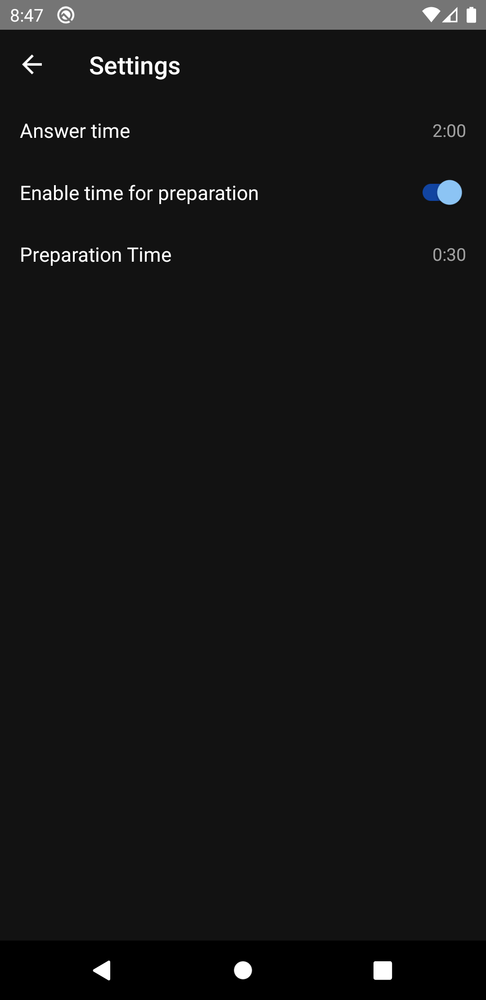

# Cue Card Trainer 
Android app helping you prepare for IELTS/CPE speaking part. Each card is a speaking exercise prompting the candidate to speak about a given topic for a specified time (usually 2 minutes). Card topics are usually quite diverse and range from simple questions about hobbies or family to more sophisticated discussions about art, philosophy, or outlook on life.  

This app uses a database of cue cards scraped using the [Cue Cards Scraper](https://github.com/wblachowski/cue-cards-scraper) script. As of now, the database contains 700+ cards, which translates to approximately 24 hours of practice - should be more than enough even for the most avid learners. 

## Screenshots

  
  
  

  
  
  

